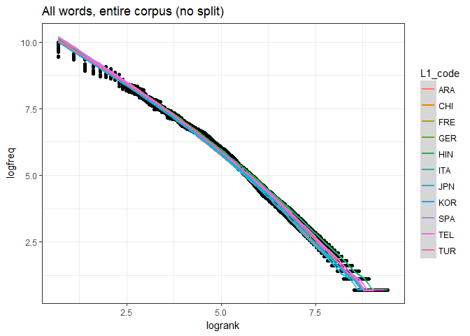
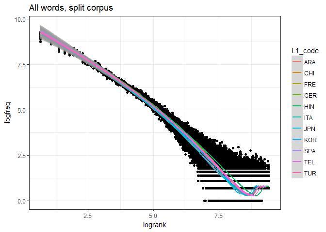
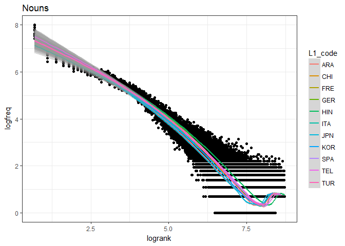
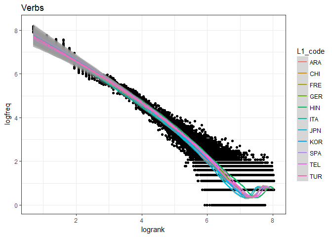

# toefl_zipfs.Rmd
Soo Wan Kim  
November 27, 2017  


```r
knitr::opts_chunk$set(echo = TRUE, message = FALSE, warning = FALSE)

library(tidyverse)
library(feather)
library("hunspell")
library(openNLP)
library(NLP)

new_data <- read_feather("essay_word_counts_clean.feather")
set.seed(1234)
theme_set(theme_bw())
```


```r
#read in original toefl data
toe <- read_feather("essay_word_counts.feather")
metadata <- read.csv("merged_metadata.csv")
toe <- merge(toe, metadata, by = "essay_id")

#remove non-alphanumeric observations and find misspelled words
toe_all <- toe %>%
  select(essay_id, word, count, L1_code) %>%
  transform(L1_code = as.character(L1_code)) %>%
  mutate(word2 = word) %>%
  #remove punctuation marks
  transform(word2 = gsub("[^[:alnum:]]", "", word2)) %>%
  #remove blanks
  filter(word2 != "") %>%
  #determine if word is correctly spelled according to hunspell
  mutate(check = hunspell_check(word2))

#separate observations based on spellcheck
toe_all_t <- filter(toe_all, check == "TRUE")
toe_all_f <- filter(toe_all, check == "FALSE")

#for each ostensible misspelling, replace it with the first item in the 
#list of suggested spellings generated using hunspell_suggest()
toe_all_f <- toe_all_f %>%
  mutate(sugg = hunspell_suggest(word2))
toe_all_f$word2 <- sapply(toe_all_f$sugg, function(x) x[1])
toe_all_f <- na.omit(toe_all_f) %>%
  select(-sugg)

#put data back together
new_data <- rbind(toe_all_t, toe_all_f) %>%
  arrange(L1_code)
new_data$word <- new_data$word2
new_data <- new_data %>%
  select(-check, -word2) %>%
  group_by(essay_id, word, L1_code) %>%
  summarize(freq = sum(count))

#cleaned data
write_feather(new_data, "essay_word_counts_clean.feather")
```

### Word frequency distribution using entire corpus for both frequency and frequency rank calculations


```r
lang_list <- unique(new_data$L1_code)

rank <- function(lang_code) {
  batch <- new_data %>%
    filter(L1_code == lang_code) %>%
    group_by(word, L1_code) %>%
    summarize(n = sum(freq)) %>%
    arrange(desc(n)) %>%
    ungroup() %>%
    mutate(logfreq = log(n + 1))
  batch$rank <- c(1:length(batch$word))
  batch <- batch %>%
    mutate(logrank = log(rank + 1))
  batch
}

ranked <- data.frame(word=character(), 
                 L1_code=character(), 
                 n=numeric(),
                 logfreq=numeric(),
                 rank=numeric(),
                 logrank=numeric())

for(i in seq_along(lang_list)) {
  lang <- lang_list[i]
  ranked <- rbind(ranked, rank(lang))
}

ggplot(ranked) + 
  geom_point(aes(logrank, logfreq)) + 
  geom_smooth(aes(logrank, logfreq, color = L1_code)) + 
  labs(title = "All words, entire corpus (no split)")
```

<!-- -->

### Word frequency distribution with split corpus for frequency and frequency rank calculations

To mimic using two independent corpora for the frequency and frequency rank calculations (to avoid spurious correlation), I split the corpus into two subcorpora via a binomial split.


```r
lang_list <- unique(new_data$L1_code)

#for splitting corpus into two independent corpora for calculating frequency and frequency rank
split <- function(data) {
  data$freq_n <- sapply(data$freq, function(x) rbinom(n = 1, size = x, prob = 0.5))
  data <- data %>%
    mutate(rank_n = freq - freq_n) %>%
    rename(n = freq)
  data
}

#for calculating log frequency
logfreq <- function(lang_code, data) {
  batch <- data %>%
    filter(L1_code == lang_code) %>%
    group_by(word, L1_code) %>%
    summarize(freq = sum(freq_n)) %>%
    arrange(desc(freq)) %>%
    ungroup() %>%
    mutate(logfreq = log(freq + 1))
  batch
}

logfreq_compile <- function(data) {
  #initialize dataframe
  logfreqd <- data.frame(word=character(), 
                 L1_code=character(), 
                 freq=numeric(),
                 logfreq=numeric())
  
  for(i in seq_along(lang_list)) {
    lang <- lang_list[i]
    logfreqd <- rbind(logfreqd, logfreq(lang, data))
  }
  logfreqd
}

#for calculating log rank

logrank <- function(lang_code, data) {
  batch <- data %>%
    filter(L1_code == lang_code) %>%
    group_by(word, L1_code) %>%
    summarize(rank_freq = sum(rank_n)) %>%
    arrange(desc(rank_freq)) %>%
    ungroup()
  batch$rank <- c(1:length(batch$word))
  batch <- batch %>%
    mutate(logrank = log(rank + 1))
  batch
}

logrank_compile <- function(data) {
  #initialize dataframe
  logranked <- data.frame(word=character(), 
                 L1_code=character(), 
                 rank_freq=numeric(),
                 rank=numeric(),
                 logrank=numeric())
  
  for(i in seq_along(lang_list)) {
    lang <- lang_list[i]
    logranked <- rbind(logranked, logrank(lang, data))
  }
  logranked
}
```


```r
#split corpus
word_freq_all <- split(new_data)

#calculate log frequency
log_freq_all <- logfreq_compile(word_freq_all)

#calculate log rank
log_rank_all <- logrank_compile(word_freq_all)

#combine data
log_data_all <- left_join(log_freq_all, log_rank_all)

ggplot(log_data_all) + 
  geom_point(aes(logrank, logfreq)) + 
  geom_smooth(aes(logrank, logfreq, color = L1_code)) + 
  labs(title = "All words, split corpus")
```

<!-- -->

### Frequency distributions for different parts of speech


```r
#unique list of words in string form
words <- as.String(unique(new_data$word))

#functions to extract parts of speech
sent_token_annotator <- Maxent_Sent_Token_Annotator()
word_token_annotator <- Maxent_Word_Token_Annotator()
pos_tag_annotator <- Maxent_POS_Tag_Annotator()

POS <- annotate(words, list(sent_token_annotator, word_token_annotator))

#POS tags
POS_tg <- annotate(words, pos_tag_annotator, POS)
#remove sentence in the beginning
POS_tg_subset <- subset(POS_tg, type=="word")

#convert list of POS tags into dataframe
tgdf <- as.data.frame(POS_tg_subset)
tgdf$tags <- sapply(POS_tg_subset$features, '[[', "POS")

#attach words to dataframe
text <- c()

for(i in 1:nrow(tgdf)) {
  start <- tgdf[i,]$start
  end <- tgdf[i,]$end
  txt <- substr(words, start, end)
  text <- append(text, txt)
}

tgdf$word <- text

#lists of unique nouns and verbs
#(the tags for parts of speech can be found at: #https://www.ling.upenn.edu/courses/Fall_2003/ling001/penn_treebank_pos.html)
nouns <- unique(subset(tgdf, tags %in% c("NN", "NNS", "NNP", "NNPS"))$word)
verbs <- unique(subset(tgdf, tags %in% c("VB", "VBD", "VBG", "VBN", "VBP", "VBZ"))$word)
```


```r
nouns_data <- new_data %>%
  filter(word %in% nouns)

#split corpus
word_freq_noun <- split(nouns_data)

#calculate log frequency
log_freq_noun <- logfreq_compile(word_freq_noun)

#calculate log rank
log_rank_noun <- logrank_compile(word_freq_noun)

#combine data
log_data_noun <- left_join(log_freq_noun, log_rank_noun)

ggplot(log_data_noun) + 
  geom_point(aes(logrank, logfreq)) + 
  geom_smooth(aes(logrank, logfreq, color = L1_code)) + 
  labs(title = "Nouns")
```

<!-- -->


```r
verbs_data <- new_data %>%
  filter(word %in% verbs)

#split corpus
word_freq_verb <- split(verbs_data)

#calculate log frequency
log_freq_verb <- logfreq_compile(word_freq_verb)

#calculate log rank
log_rank_verb <- logrank_compile(word_freq_verb)

#combine data
log_data_verb <- left_join(log_freq_verb, log_rank_verb)

ggplot(log_data_verb) + 
  geom_point(aes(logrank, logfreq)) + 
  geom_smooth(aes(logrank, logfreq, color = L1_code)) + 
  labs(title = "Verbs")
```

<!-- -->


```r
new_freq_data <- log_data_all[-5]
write_feather(new_freq_data, "essay_word_counts_clean_freq.feather")
```

