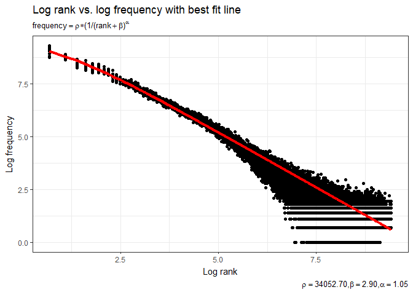
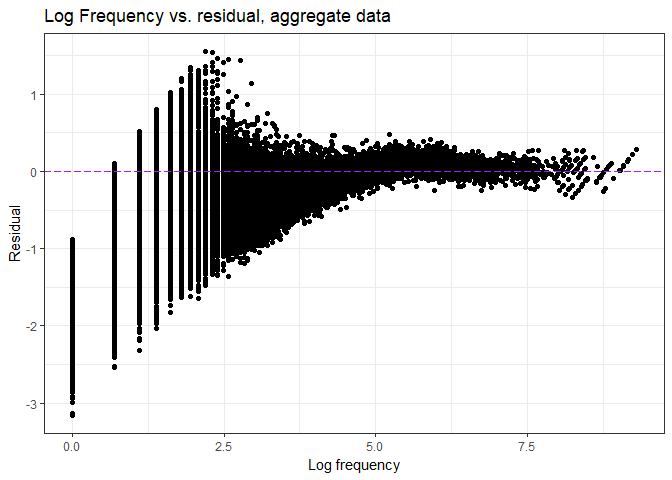
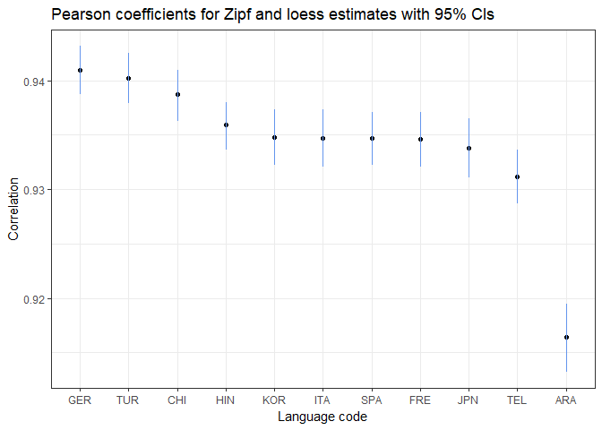

# toefl_zipfs.Rmd
Soo Wan Kim  
December 18, 2017  


```r
knitr::opts_chunk$set(echo = TRUE, message = FALSE, warning = FALSE, cache = TRUE)

library(tidyverse)
library(feather)
library(minpack.lm)
library(latex2exp)
library(knitr)

new_freq_data <- read_feather("essay_word_counts_clean_freq.feather")
set.seed(1234)
theme_set(theme_bw())
```

### Testing Zipf's Law

We use Mandelbrot's generalization of the Zipfian distribution (Mandelbrot 1962):

$f(r) \propto \frac{1}{(r + \beta)^\alpha}$

where $f(r)$ is the word frequency, $r$ is the freqency rank, $\alpha \approx 1$, and $\beta \approx 2.7$. 

To fit the word frequency data, we use the equation

$frequency = \rho\frac{1}{(rank + \beta)^\alpha}$ 

where $\rho$ is the unknown proportionality constant.


```r
#estimate parameters p = rho, b = beta, a = alpha

eqfit <- nlsLM(freq ~ p *(1/(rank + b)^a),
              start = list(p = 1, b = 2.7, a = 1), #starting values
              data = new_freq_data)

coefs <- coef(eqfit)
p <- coefs[[1]]
b <- coefs[[2]]
a <- coefs[[3]]

#create predicted values for log frequency
new_freq_data2 <- new_freq_data %>%
  mutate(logfreqpred = log(p *(1/(rank + b)^a)))

#plot predicted log frequency against actual log frequency
ggplot(new_freq_data2) + 
  geom_point(aes(logrank, logfreq)) + 
  geom_line(aes(logrank, logfreqpred), color = "red", size = 1.6) + 
  labs(title = "Log rank vs. log frequency with best fit line",
       x = "Log rank", y = "Log frequency",
       subtitle = TeX('$frequency = \\rho * (1/(rank + \\beta)^\\alpha$'),
       caption = TeX('$\\rho = 34052.70, \\beta = 2.90, \\alpha = 1.05$'))
```

<!-- -->

Next, we plot the residuals against log frequencies.


```r
#calculate residuals
new_freq_data2$logfreqresid <- new_freq_data2$logfreq - new_freq_data2$logfreqpred

#plot log frequencies and residuals
ggplot(data = new_freq_data2, mapping = aes(x = logfreq, y = logfreqresid)) +
  geom_point() + 
  labs(title = "Log Frequency vs. residual, aggregate data",
       x = "Log frequency", 
       y = "Residual") + 
  geom_hline(yintercept = 0, linetype="longdash", color = "purple")
```

<!-- -->

Repeat for each language code and add loess estimates.


```r
lang_list <- unique(new_freq_data$L1_code)

#function to estimate zipf parameters and 
#calculate predicted log frequencies and residuals for each language code

eqfit_lc <- function(lang_code) {
  lcdata <- subset(new_freq_data, L1_code == lang_code)
  #estimate parameters
  mod <- nlsLM(freq ~ p *(1/(rank + b)^a),
              start = list(p = 1, b = 2.7, a = 1), #starting values
              data = lcdata)
  coefs <- coef(mod)
  lcdata$p <- coefs[[1]]
  lcdata$b <- coefs[[2]]
  lcdata$a <- coefs[[3]]  
  
  #calculate predicted values
  lcdata <- mutate(lcdata, logfreqpredz = log(p *(1/(rank + b)^a)))
  
  #calculate residuals
  lcdata <- mutate(lcdata, logfreqresidz = logfreq - logfreqpredz)
  
  lcdata
}

#function to calculate loess estimates

loess50 <- function(lang_code, sp) {
  data <- subset(new_freq_data, L1_code == lang_code)
  loess_mod50 <- loess(logfreq ~ logrank, data=data, span=sp)
  loess_est50 <- predict(loess_mod50)
  df <- as.data.frame(loess_est50)
}

#compile estimates for all language codes

zipf_loess_est <- data.frame(word = character(), #initalize dataframe
                             L1_code=character(),
                             freq=integer(),
                             logfreq=numeric(),
                             rank=integer(),
                             logrank=numeric(),
                             p=numeric(),
                             b=numeric(),
                             a=numeric(),
                             logfreqpredz=numeric(),
                             logfreqresidz=numeric(),
                             loess_est50=numeric())

for(i in seq_along(lang_list)) {
  lang <- lang_list[i]
  zipf_loess_est <- rbind(zipf_loess_est, cbind(eqfit_lc(lang), loess50(lang, 0.50)))
}
```


```r
#plot log frequencies versus zipf predictions
ggplot(zipf_loess_est) + 
  geom_point(aes(logrank, logfreq)) + 
  geom_line(aes(logrank, logfreqpredz), color = "red") + 
  geom_line(aes(logrank, loess_est50), color = "cyan") + 
  labs(title = "Log rank vs. log frequency with best fit line, by language code",
       x = "Log rank", y = "Log frequency",
       subtitle = TeX('$frequency = \\rho * (1/(rank + \\beta)^\\alpha$')) +
  facet_wrap(~L1_code)
```


```r
#plot log frequencies and residuals
ggplot(data = zipf_loess_est, mapping = aes(x = logfreq, y = logfreqresidz)) +
  geom_point() + 
  labs(title = "Log Frequency vs. residual, by language code",
       x = "Log frequency", 
       y = "Residual") + 
  geom_hline(yintercept = 0, linetype="longdash", color = "purple") + 
  facet_wrap(~L1_code)
```


#### Zipfian distribution parameter estimates


```r
zipf_param <- zipf_loess_est %>%
  select(L1_code, p, b, a) %>%
  unique() %>%
  transform(b = round(b, 2)) %>%
  transform(a = round(a, 2)) %>%
  arrange(desc(b))

rownames(zipf_param) <- NULL

zipf_param %>%
  kable(format = "html", col.names = c("L1_code", "rho", "beta", "alpha"), align = 'l', table.attr = "style='width:70%;'")
```

<table style='width:70%;'>
 <thead>
  <tr>
   <th style="text-align:left;"> L1_code </th>
   <th style="text-align:left;"> rho </th>
   <th style="text-align:left;"> beta </th>
   <th style="text-align:left;"> alpha </th>
  </tr>
 </thead>
<tbody>
  <tr>
   <td style="text-align:left;"> JPN </td>
   <td style="text-align:left;"> 41789.82 </td>
   <td style="text-align:left;"> 4.66 </td>
   <td style="text-align:left;"> 1.10 </td>
  </tr>
  <tr>
   <td style="text-align:left;"> KOR </td>
   <td style="text-align:left;"> 43003.85 </td>
   <td style="text-align:left;"> 4.64 </td>
   <td style="text-align:left;"> 1.09 </td>
  </tr>
  <tr>
   <td style="text-align:left;"> GER </td>
   <td style="text-align:left;"> 45494.88 </td>
   <td style="text-align:left;"> 3.67 </td>
   <td style="text-align:left;"> 1.09 </td>
  </tr>
  <tr>
   <td style="text-align:left;"> ITA </td>
   <td style="text-align:left;"> 42597.25 </td>
   <td style="text-align:left;"> 3.51 </td>
   <td style="text-align:left;"> 1.12 </td>
  </tr>
  <tr>
   <td style="text-align:left;"> FRE </td>
   <td style="text-align:left;"> 41541.33 </td>
   <td style="text-align:left;"> 3.45 </td>
   <td style="text-align:left;"> 1.09 </td>
  </tr>
  <tr>
   <td style="text-align:left;"> ARA </td>
   <td style="text-align:left;"> 33391.43 </td>
   <td style="text-align:left;"> 3.23 </td>
   <td style="text-align:left;"> 1.06 </td>
  </tr>
  <tr>
   <td style="text-align:left;"> SPA </td>
   <td style="text-align:left;"> 41180.60 </td>
   <td style="text-align:left;"> 3.11 </td>
   <td style="text-align:left;"> 1.08 </td>
  </tr>
  <tr>
   <td style="text-align:left;"> TUR </td>
   <td style="text-align:left;"> 29694.38 </td>
   <td style="text-align:left;"> 2.54 </td>
   <td style="text-align:left;"> 1.01 </td>
  </tr>
  <tr>
   <td style="text-align:left;"> HIN </td>
   <td style="text-align:left;"> 31072.39 </td>
   <td style="text-align:left;"> 2.11 </td>
   <td style="text-align:left;"> 1.02 </td>
  </tr>
  <tr>
   <td style="text-align:left;"> CHI </td>
   <td style="text-align:left;"> 24056.43 </td>
   <td style="text-align:left;"> 1.79 </td>
   <td style="text-align:left;"> 0.96 </td>
  </tr>
  <tr>
   <td style="text-align:left;"> TEL </td>
   <td style="text-align:left;"> 20537.65 </td>
   <td style="text-align:left;"> 1.09 </td>
   <td style="text-align:left;"> 0.93 </td>
  </tr>
</tbody>
</table>

### Pearson correlations between Zipf and loess estimates by language code


```r
zipf_loess_est_sum <- zipf_loess_est %>%
  select(L1_code, logfreqpredz, loess_est50)

#function to calculate correlations and correlation p-value using Pearson test

get_corr <- function(lang_code) {
  data <- subset(zipf_loess_est_sum, L1_code == lang_code)
  data2 <- select(data, -L1_code)
  x <- as.matrix(data2)
  c <- cor.test(x[,1], x[,2], method = "pearson", conf.level = 0.95)
  cor_val <- round(c$estimate[[1]], 4)
  cor_CI <- c$conf.int
  cor_CI_lower <- round(cor_CI[1], 4)
  cor_CI_upper <- round(cor_CI[2], 4)
  row <- as.data.frame(t(c(lang_code, cor_val, cor_CI_lower, cor_CI_upper)))
  names(row) <- c("L1_code", "cor_val", "cor_CI_lower", "cor_CI_upper")
  rownames(row) <- NULL
  row
}

#compile correlations for all language codes

zipf_loess_cor <- data.frame(L1_code=character(), #initalize dataframe
                            cor_val=numeric(),
                            cor_CI_lower=numeric(),
                            cor_CI_upper=numeric())

for(i in seq_along(lang_list)) {
  lang <- lang_list[i]
  zipf_loess_cor <- rbind(zipf_loess_cor, get_corr(lang)) %>%
    transform(cor_val = as.numeric(as.character(cor_val))) %>%
    transform(cor_CI_lower = as.numeric(as.character(cor_CI_lower))) %>%
    transform(cor_CI_upper = as.numeric(as.character(cor_CI_upper))) %>%
    arrange(desc(cor_val))
}

#re-order factor levels for language code, for graphing purposes
zipf_loess_cor$L1_code <- factor(zipf_loess_cor$L1_code, levels = zipf_loess_cor$L1_code)

#correlations table
zipf_loess_cor %>%
  mutate(cor_CI = paste0("(", cor_CI_lower, ", ", cor_CI_upper, ")")) %>%
  select(-cor_CI_lower, -cor_CI_upper) %>%
  kable(format = "html", col.names = c("L1_code", "Pearson coefficient", "95% Conf. Interval"), align = 'l', table.attr = "style='width:70%;'")
```

<table style='width:70%;'>
 <thead>
  <tr>
   <th style="text-align:left;"> L1_code </th>
   <th style="text-align:left;"> Pearson coefficient </th>
   <th style="text-align:left;"> 95% Conf. Interval </th>
  </tr>
 </thead>
<tbody>
  <tr>
   <td style="text-align:left;"> GER </td>
   <td style="text-align:left;"> 0.9410 </td>
   <td style="text-align:left;"> (0.9387, 0.9432) </td>
  </tr>
  <tr>
   <td style="text-align:left;"> TUR </td>
   <td style="text-align:left;"> 0.9402 </td>
   <td style="text-align:left;"> (0.9379, 0.9425) </td>
  </tr>
  <tr>
   <td style="text-align:left;"> CHI </td>
   <td style="text-align:left;"> 0.9387 </td>
   <td style="text-align:left;"> (0.9363, 0.941) </td>
  </tr>
  <tr>
   <td style="text-align:left;"> HIN </td>
   <td style="text-align:left;"> 0.9359 </td>
   <td style="text-align:left;"> (0.9336, 0.938) </td>
  </tr>
  <tr>
   <td style="text-align:left;"> KOR </td>
   <td style="text-align:left;"> 0.9348 </td>
   <td style="text-align:left;"> (0.9322, 0.9373) </td>
  </tr>
  <tr>
   <td style="text-align:left;"> ITA </td>
   <td style="text-align:left;"> 0.9347 </td>
   <td style="text-align:left;"> (0.9321, 0.9373) </td>
  </tr>
  <tr>
   <td style="text-align:left;"> SPA </td>
   <td style="text-align:left;"> 0.9347 </td>
   <td style="text-align:left;"> (0.9322, 0.9371) </td>
  </tr>
  <tr>
   <td style="text-align:left;"> FRE </td>
   <td style="text-align:left;"> 0.9346 </td>
   <td style="text-align:left;"> (0.9321, 0.9371) </td>
  </tr>
  <tr>
   <td style="text-align:left;"> JPN </td>
   <td style="text-align:left;"> 0.9338 </td>
   <td style="text-align:left;"> (0.9311, 0.9365) </td>
  </tr>
  <tr>
   <td style="text-align:left;"> TEL </td>
   <td style="text-align:left;"> 0.9312 </td>
   <td style="text-align:left;"> (0.9287, 0.9336) </td>
  </tr>
  <tr>
   <td style="text-align:left;"> ARA </td>
   <td style="text-align:left;"> 0.9164 </td>
   <td style="text-align:left;"> (0.9132, 0.9195) </td>
  </tr>
</tbody>
</table>

```r
#correlations plot
ggplot(zipf_loess_cor) +
  labs(title = "Pearson coefficients for Zipf and loess estimates with 95% CIs",
       x = "Language code", y = "Correlation") + 
  geom_point(aes(L1_code, cor_val)) + 
  geom_segment(aes(x = L1_code, y = cor_CI_lower, xend = L1_code, yend = cor_CI_upper), color = "#6495ed")
```

<!-- -->

