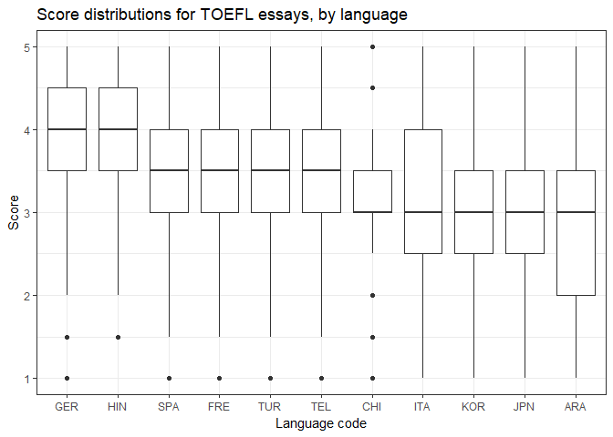
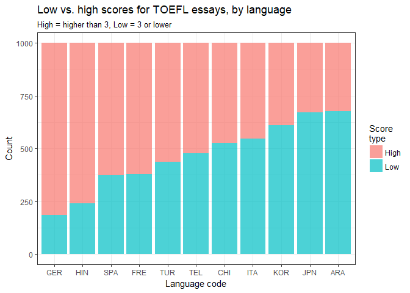
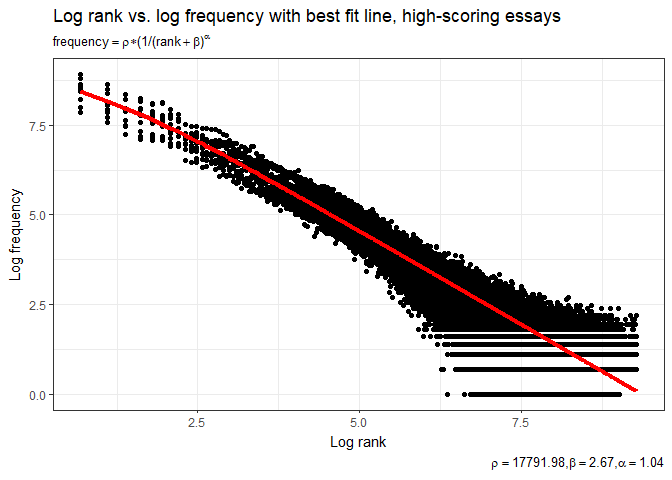
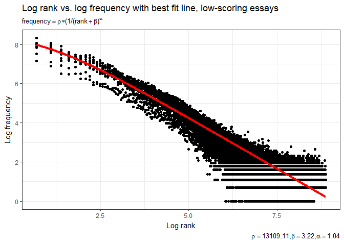
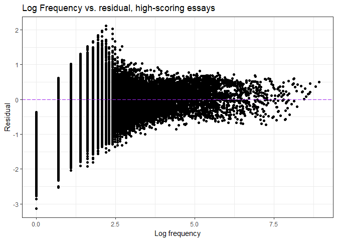
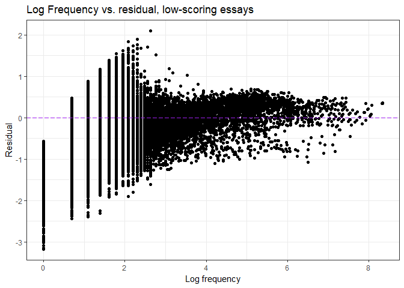
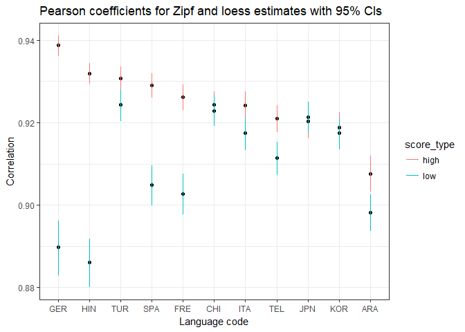

# toefl_zipfs.Rmd
Soo Wan Kim  
December 22, 2017  


```r
knitr::opts_chunk$set(echo = TRUE, message = FALSE, warning = FALSE, cache = TRUE)

library(tidyverse)
library(feather)
library(minpack.lm)
library(latex2exp)
library(knitr)

new_data <- read_feather("essay_word_counts_clean.feather")
metadata <- read.csv("merged_metadata.csv") %>%
  transform(L1_code = as.character(L1_code)) %>%
  transform(essay_id = as.character(essay_id))

set.seed(1234)
theme_set(theme_bw())
```


```r
metadata <- metadata %>%
  mutate(score_range = ifelse(score <= 3, "Low", ifelse(score > 3, "High", NA))) %>%
  na.omit()

score_avg <- metadata %>%
  group_by(L1_code) %>%
  summarize(avg = mean(score)) %>%
  arrange(desc(avg))

#reorder country codes, for graphing purposes
metadata2 <- metadata %>%
  transform(L1_code = factor(L1_code, levels = score_avg$L1_code))

ggplot(metadata2, aes(L1_code, score)) + 
  geom_boxplot() + 
  labs(title = "Score distributions for TOEFL essays, by language", 
       x = "Language code", y = "Score")
```

<!-- -->

```r
metadata_count <- metadata2 %>%
  group_by(L1_code, score_range) %>%
  summarize(count = n())
  
ggplot(metadata_count, aes(L1_code, count)) + 
  geom_bar(aes(fill = score_range), stat = "identity", position = "stack", alpha = 0.7) + 
  labs(title = "Low vs. high scores for TOEFL essays, by language",
       subtitle = "High = higher than 3, Low = 3 or lower",
       x = "Language code", y = "Count",
       fill = "Score\ntype")
```

<!-- -->


```r
lang_list <- unique(new_data$L1_code)

#for splitting corpus into two independent corpora for calculating frequency and frequency rank
split <- function(data) {
  data$freq_n <- sapply(data$freq, function(x) rbinom(n = 1, size = x, prob = 0.5))
  data <- data %>%
    mutate(rank_n = freq - freq_n) %>%
    rename(n = freq)
  data
}

#for calculating log frequency
logfreq <- function(lang_code, data) {
  batch <- data %>%
    filter(L1_code == lang_code) %>%
    group_by(word, L1_code) %>%
    summarize(freq = sum(freq_n)) %>%
    arrange(desc(freq)) %>%
    ungroup() %>%
    mutate(logfreq = log(freq + 1))
  batch
}

logfreq_compile <- function(data) {
  #initialize dataframe
  logfreqd <- data.frame(word=character(), 
                 L1_code=character(), 
                 freq=numeric(),
                 logfreq=numeric())
  
  for(i in seq_along(lang_list)) {
    lang <- lang_list[i]
    logfreqd <- rbind(logfreqd, logfreq(lang, data))
  }
  logfreqd
}

#for calculating log rank

logrank <- function(lang_code, data) {
  batch <- data %>%
    filter(L1_code == lang_code) %>%
    group_by(word, L1_code) %>%
    summarize(rank_freq = sum(rank_n)) %>%
    arrange(desc(rank_freq)) %>%
    ungroup()
  batch$rank <- c(1:length(batch$word))
  batch <- batch %>%
    mutate(logrank = log(rank + 1))
  batch
}

logrank_compile <- function(data) {
  #initialize dataframe
  logranked <- data.frame(word=character(), 
                 L1_code=character(), 
                 rank_freq=numeric(),
                 rank=numeric(),
                 logrank=numeric())
  
  for(i in seq_along(lang_list)) {
    lang <- lang_list[i]
    logranked <- rbind(logranked, logrank(lang, data))
  }
  logranked
}
```

### Word frequency-rank distributions for all words


```r
#attach score metadata to frequency data

#separate by score type
new_data_score <- left_join(new_data, metadata)
new_data_high <- subset(new_data_score, score_range == "High")
new_data_low <- subset(new_data_score, score_range == "Low")
rm(new_data_score)

#perform binomial split on "high" and "low" subsets

#split each subset
word_freq_all_high <- split(new_data_high)
word_freq_all_low <- split(new_data_low)

#calculate log frequency for each subset
log_freq_all_high <- logfreq_compile(word_freq_all_high)
log_freq_all_low <- logfreq_compile(word_freq_all_low)

#calculate log rank for each subset
log_rank_all_high <- logrank_compile(word_freq_all_high)
log_rank_all_low <- logrank_compile(word_freq_all_low)

#combine data
log_data_all_high <- left_join(log_freq_all_high, log_rank_all_high) %>%
  mutate(essay_type = "High-scoring Essays")

log_data_all_low <- left_join(log_freq_all_low, log_rank_all_low) %>%
  mutate(essay_type = "Low-scoring Essays")

log_data_all <- rbind(log_data_all_high, log_data_all_low)

ggplot(log_data_all) + 
  geom_point(aes(logrank, logfreq)) + 
  geom_smooth(aes(logrank, logfreq, color = L1_code)) + 
  labs(title = "All words") +
  facet_wrap(~essay_type) + 
  theme(legend.position = "bottom")
```


### Testing Zipf's Law


```r
#estimate parameters p = rho, b = beta, a = alpha

#for high scores only

eqfit_high <- nlsLM(freq ~ p *(1/(rank + b)^a),
              start = list(p = 1, b = 2.7, a = 1), #starting values
              data = log_data_all_high)

coefs_high <- coef(eqfit_high)
p_high <- coefs_high[[1]]
b_high <- coefs_high[[2]]
a_high <- coefs_high[[3]]

##create predicted values for log frequency
log_data_all_high2 <- log_data_all_high %>%
  mutate(logfreqpred = log(p_high *(1/(rank + b_high)^a_high)))

##plot predicted log frequency against actual log frequency
ggplot(log_data_all_high2) + 
  geom_point(aes(logrank, logfreq)) + 
  geom_line(aes(logrank, logfreqpred), color = "red", size = 1.6) + 
  labs(title = "Log rank vs. log frequency with best fit line, high-scoring essays",
       x = "Log rank", y = "Log frequency",
       subtitle = TeX('$frequency = \\rho * (1/(rank + \\beta)^\\alpha$'),
       caption = TeX('$\\rho = 17791.98, \\beta = 2.67, \\alpha = 1.04$'))
```

<!-- -->

```r
#for low scores only
eqfit_low <- nlsLM(freq ~ p *(1/(rank + b)^a),
              start = list(p = 1, b = 2.7, a = 1), #starting values
              data = log_data_all_low)

coefs_low <- coef(eqfit_low)
p_low <- coefs_low[[1]]
b_low <- coefs_low[[2]]
a_low <- coefs_low[[3]]

##create predicted values for log frequency
log_data_all_low2 <- log_data_all_low %>%
  mutate(logfreqpred = log(p_low *(1/(rank + b_low)^a_low)))

##plot predicted log frequency against actual log frequency
ggplot(log_data_all_low2) + 
  geom_point(aes(logrank, logfreq)) + 
  geom_line(aes(logrank, logfreqpred), color = "red", size = 1.6) + 
  labs(title = "Log rank vs. log frequency with best fit line, low-scoring essays",
       x = "Log rank", y = "Log frequency",
       subtitle = TeX('$frequency = \\rho * (1/(rank + \\beta)^\\alpha$'),
       caption = TeX('$\\rho = 13109.11, \\beta = 3.22, \\alpha = 1.04$'))
```

<!-- -->

Next, we plot the residuals against log frequencies.


```r
#high scores only

##calculate residuals
log_data_all_high2$logfreqresid <- log_data_all_high2$logfreq - log_data_all_high2$logfreqpred

##plot log frequencies and residuals
ggplot(data = log_data_all_high2, mapping = aes(x = logfreq, y = logfreqresid)) +
  geom_point() + 
  labs(title = "Log Frequency vs. residual, high-scoring essays",
       x = "Log frequency", 
       y = "Residual") + 
  geom_hline(yintercept = 0, linetype="longdash", color = "purple")
```

<!-- -->

```r
#low scores only

##calculate residuals
log_data_all_low2$logfreqresid <- log_data_all_low2$logfreq - log_data_all_low2$logfreqpred

##plot log frequencies and residuals
ggplot(data = log_data_all_low2, mapping = aes(x = logfreq, y = logfreqresid)) +
  geom_point() + 
  labs(title = "Log Frequency vs. residual, low-scoring essays",
       x = "Log frequency", 
       y = "Residual") + 
  geom_hline(yintercept = 0, linetype="longdash", color = "purple")
```

<!-- -->

Repeat for each language code and add loess estimates.


```r
lang_list <- unique(new_data$L1_code)

#function to estimate zipf parameters and 
#calculate predicted log frequencies and residuals for each language code

eqfit_lc <- function(lang_code, data) {
  lcdata <- subset(data, L1_code == lang_code)
  #estimate parameters
  mod <- nlsLM(freq ~ p *(1/(rank + b)^a),
              start = list(p = 1, b = 2.7, a = 1), #starting values
              data = lcdata)
  coefs <- coef(mod)
  lcdata$p <- coefs[[1]]
  lcdata$b <- coefs[[2]]
  lcdata$a <- coefs[[3]]  
  
  #calculate predicted values
  lcdata <- mutate(lcdata, logfreqpredz = log(p *(1/(rank + b)^a)))
  
  #calculate residuals
  lcdata <- mutate(lcdata, logfreqresidz = logfreq - logfreqpredz)
  
  lcdata
}

#function to calculate loess estimates

loess50 <- function(lang_code, data, sp) {
  data <- subset(data, L1_code == lang_code)
  loess_mod50 <- loess(logfreq ~ logrank, data=data, span=sp)
  loess_est50 <- predict(loess_mod50)
  df <- as.data.frame(loess_est50)
}

#compile estimates for all language codes, high scores only

zipf_loess_est_high <- data.frame(word = character(), #initalize dataframe
                             L1_code=character(),
                             freq=integer(),
                             logfreq=numeric(),
                             rank=integer(),
                             logrank=numeric(),
                             p=numeric(),
                             b=numeric(),
                             a=numeric(),
                             logfreqpredz=numeric(),
                             logfreqresidz=numeric(),
                             loess_est50=numeric())

for(i in seq_along(lang_list)) {
  lang <- lang_list[i]
  zipf_loess_est_high <- rbind(zipf_loess_est_high, cbind(eqfit_lc(lang, log_data_all_high), 
                                                          loess50(lang, log_data_all_high, 0.50)))
}

#compile estimates for all language codes, low scores only

zipf_loess_est_low <- data.frame(word = character(), #initalize dataframe
                             L1_code=character(),
                             freq=integer(),
                             logfreq=numeric(),
                             rank=integer(),
                             logrank=numeric(),
                             p=numeric(),
                             b=numeric(),
                             a=numeric(),
                             logfreqpredz=numeric(),
                             logfreqresidz=numeric(),
                             loess_est50=numeric())

for(i in seq_along(lang_list)) {
  lang <- lang_list[i]
  zipf_loess_est_low <- rbind(zipf_loess_est_low, cbind(eqfit_lc(lang, log_data_all_low), 
                                                          loess50(lang, log_data_all_low, 0.50)))
}
```


```r
#plot log frequencies versus zipf predictions

##high scores only
ggplot(zipf_loess_est_high) + 
  geom_point(aes(logrank, logfreq)) + 
  geom_line(aes(logrank, logfreqpredz), color = "red") + 
  geom_line(aes(logrank, loess_est50), color = "cyan") + 
  labs(title = "Log rank vs. log frequency with best fit line, by language code",
       subtitle = "High-scoring essays",
       x = "Log rank", y = "Log frequency",
       subtitle = TeX('$frequency = \\rho * (1/(rank + \\beta)^\\alpha$')) +
  facet_wrap(~L1_code)
```


```r
##low scores only

ggplot(zipf_loess_est_low) + 
  geom_point(aes(logrank, logfreq)) + 
  geom_line(aes(logrank, logfreqpredz), color = "red") + 
  geom_line(aes(logrank, loess_est50), color = "cyan") + 
  labs(title = "Log rank vs. log frequency with best fit line, by language code",
       subtitle = "Low-scoring essays",
       x = "Log rank", y = "Log frequency",
       subtitle = TeX('$frequency = \\rho * (1/(rank + \\beta)^\\alpha$')) +
  facet_wrap(~L1_code)
```


```r
#plot log frequencies and residuals

##high scores only
ggplot(data = zipf_loess_est_high, mapping = aes(x = logfreq, y = logfreqresidz)) +
  geom_point() + 
  labs(title = "Log Frequency vs. residual by language code, high-scoring essays",
       x = "Log frequency", 
       y = "Residual") + 
  geom_hline(yintercept = 0, linetype="longdash", color = "purple") + 
  facet_wrap(~L1_code)
```


```r
##low scores only
ggplot(data = zipf_loess_est_low, mapping = aes(x = logfreq, y = logfreqresidz)) +
  geom_point() + 
  labs(title = "Log Frequency vs. residual by language code, low-scoring essays",
       x = "Log frequency", 
       y = "Residual") + 
  geom_hline(yintercept = 0, linetype="longdash", color = "purple") + 
  facet_wrap(~L1_code)
```


#### Zipfian distribution parameter estimates


```r
zipf_param_high <- zipf_loess_est_high %>%
  select(L1_code, p, b, a) %>%
  unique() %>%
  transform(b = round(b, 2)) %>%
  transform(a = round(a, 2)) %>%
  arrange(desc(b))

rownames(zipf_param_high) <- NULL

zipf_param_high %>%
  kable(format = "html", caption = "High-scoring essays",
        col.names = c("L1_code", "rho", "beta", "alpha"), align = 'l', table.attr = "style='width:70%;'")
```

<table style='width:70%;'>
<caption>High-scoring essays</caption>
 <thead>
  <tr>
   <th style="text-align:left;"> L1_code </th>
   <th style="text-align:left;"> rho </th>
   <th style="text-align:left;"> beta </th>
   <th style="text-align:left;"> alpha </th>
  </tr>
 </thead>
<tbody>
  <tr>
   <td style="text-align:left;"> KOR </td>
   <td style="text-align:left;"> 15284.74 </td>
   <td style="text-align:left;"> 3.71 </td>
   <td style="text-align:left;"> 1.07 </td>
  </tr>
  <tr>
   <td style="text-align:left;"> GER </td>
   <td style="text-align:left;"> 34649.03 </td>
   <td style="text-align:left;"> 3.62 </td>
   <td style="text-align:left;"> 1.09 </td>
  </tr>
  <tr>
   <td style="text-align:left;"> FRE </td>
   <td style="text-align:left;"> 25505.80 </td>
   <td style="text-align:left;"> 3.47 </td>
   <td style="text-align:left;"> 1.09 </td>
  </tr>
  <tr>
   <td style="text-align:left;"> JPN </td>
   <td style="text-align:left;"> 11994.46 </td>
   <td style="text-align:left;"> 3.42 </td>
   <td style="text-align:left;"> 1.06 </td>
  </tr>
  <tr>
   <td style="text-align:left;"> ARA </td>
   <td style="text-align:left;"> 12693.26 </td>
   <td style="text-align:left;"> 3.40 </td>
   <td style="text-align:left;"> 1.09 </td>
  </tr>
  <tr>
   <td style="text-align:left;"> ITA </td>
   <td style="text-align:left;"> 18942.78 </td>
   <td style="text-align:left;"> 3.40 </td>
   <td style="text-align:left;"> 1.11 </td>
  </tr>
  <tr>
   <td style="text-align:left;"> SPA </td>
   <td style="text-align:left;"> 26469.85 </td>
   <td style="text-align:left;"> 3.36 </td>
   <td style="text-align:left;"> 1.10 </td>
  </tr>
  <tr>
   <td style="text-align:left;"> HIN </td>
   <td style="text-align:left;"> 22202.32 </td>
   <td style="text-align:left;"> 1.99 </td>
   <td style="text-align:left;"> 1.02 </td>
  </tr>
  <tr>
   <td style="text-align:left;"> TUR </td>
   <td style="text-align:left;"> 14834.17 </td>
   <td style="text-align:left;"> 1.92 </td>
   <td style="text-align:left;"> 0.99 </td>
  </tr>
  <tr>
   <td style="text-align:left;"> CHI </td>
   <td style="text-align:left;"> 11799.37 </td>
   <td style="text-align:left;"> 1.74 </td>
   <td style="text-align:left;"> 0.98 </td>
  </tr>
  <tr>
   <td style="text-align:left;"> TEL </td>
   <td style="text-align:left;"> 11579.37 </td>
   <td style="text-align:left;"> 1.24 </td>
   <td style="text-align:left;"> 0.96 </td>
  </tr>
</tbody>
</table>

```r
zipf_param_low <- zipf_loess_est_low %>%
  select(L1_code, p, b, a) %>%
  unique() %>%
  transform(b = round(b, 2)) %>%
  transform(a = round(a, 2)) %>%
  arrange(desc(b))

rownames(zipf_param_low) <- NULL

zipf_param_low %>%
  kable(format = "html", caption = "Low-scoring essays",
        col.names = c("L1_code", "rho", "beta", "alpha"), align = 'l', table.attr = "style='width:70%;'")
```

<table style='width:70%;'>
<caption>Low-scoring essays</caption>
 <thead>
  <tr>
   <th style="text-align:left;"> L1_code </th>
   <th style="text-align:left;"> rho </th>
   <th style="text-align:left;"> beta </th>
   <th style="text-align:left;"> alpha </th>
  </tr>
 </thead>
<tbody>
  <tr>
   <td style="text-align:left;"> JPN </td>
   <td style="text-align:left;"> 28433.009 </td>
   <td style="text-align:left;"> 5.90 </td>
   <td style="text-align:left;"> 1.14 </td>
  </tr>
  <tr>
   <td style="text-align:left;"> KOR </td>
   <td style="text-align:left;"> 24845.454 </td>
   <td style="text-align:left;"> 5.69 </td>
   <td style="text-align:left;"> 1.12 </td>
  </tr>
  <tr>
   <td style="text-align:left;"> GER </td>
   <td style="text-align:left;"> 6905.231 </td>
   <td style="text-align:left;"> 3.95 </td>
   <td style="text-align:left;"> 1.09 </td>
  </tr>
  <tr>
   <td style="text-align:left;"> FRE </td>
   <td style="text-align:left;"> 13852.982 </td>
   <td style="text-align:left;"> 3.86 </td>
   <td style="text-align:left;"> 1.10 </td>
  </tr>
  <tr>
   <td style="text-align:left;"> TUR </td>
   <td style="text-align:left;"> 12361.966 </td>
   <td style="text-align:left;"> 3.53 </td>
   <td style="text-align:left;"> 1.04 </td>
  </tr>
  <tr>
   <td style="text-align:left;"> ARA </td>
   <td style="text-align:left;"> 18372.062 </td>
   <td style="text-align:left;"> 3.28 </td>
   <td style="text-align:left;"> 1.05 </td>
  </tr>
  <tr>
   <td style="text-align:left;"> ITA </td>
   <td style="text-align:left;"> 16242.756 </td>
   <td style="text-align:left;"> 2.85 </td>
   <td style="text-align:left;"> 1.07 </td>
  </tr>
  <tr>
   <td style="text-align:left;"> SPA </td>
   <td style="text-align:left;"> 11690.797 </td>
   <td style="text-align:left;"> 2.79 </td>
   <td style="text-align:left;"> 1.06 </td>
  </tr>
  <tr>
   <td style="text-align:left;"> HIN </td>
   <td style="text-align:left;"> 5692.325 </td>
   <td style="text-align:left;"> 2.27 </td>
   <td style="text-align:left;"> 0.99 </td>
  </tr>
  <tr>
   <td style="text-align:left;"> CHI </td>
   <td style="text-align:left;"> 9886.426 </td>
   <td style="text-align:left;"> 1.74 </td>
   <td style="text-align:left;"> 0.94 </td>
  </tr>
  <tr>
   <td style="text-align:left;"> TEL </td>
   <td style="text-align:left;"> 9071.447 </td>
   <td style="text-align:left;"> 1.48 </td>
   <td style="text-align:left;"> 0.94 </td>
  </tr>
</tbody>
</table>

### Pearson correlations between Zipf and loess estimates by language code


```r
#function to calculate correlations and correlation p-value using Pearson test

get_corr <- function(lang_code, data) {
  data2 <- subset(data, L1_code == lang_code)
  data3 <- select(data2, -L1_code)
  x <- as.matrix(data3)
  c <- cor.test(x[,1], x[,2], method = "pearson", conf.level = 0.95)
  cor_val <- round(c$estimate[[1]], 4)
  cor_CI <- c$conf.int
  cor_CI_lower <- round(cor_CI[1], 4)
  cor_CI_upper <- round(cor_CI[2], 4)
  row <- as.data.frame(t(c(lang_code, cor_val, cor_CI_lower, cor_CI_upper)))
  names(row) <- c("L1_code", "cor_val", "cor_CI_lower", "cor_CI_upper")
  rownames(row) <- NULL
  row
}

#high scores

zipf_loess_est_sum_high <- zipf_loess_est_high %>%
  select(L1_code, logfreqpredz, loess_est50)

##compile correlations for all language codes

zipf_loess_cor_high <- data.frame(L1_code=character(), #initalize dataframe
                            cor_val=numeric(),
                            cor_CI_lower=numeric(),
                            cor_CI_upper=numeric())

for(i in seq_along(lang_list)) {
  lang <- lang_list[i]
  zipf_loess_cor_high <- rbind(zipf_loess_cor_high, get_corr(lang, zipf_loess_est_sum_high)) %>%
    transform(cor_val = as.numeric(as.character(cor_val))) %>%
    transform(cor_CI_lower = as.numeric(as.character(cor_CI_lower))) %>%
    transform(cor_CI_upper = as.numeric(as.character(cor_CI_upper))) %>%
    arrange(desc(cor_val))
}

##re-order factor levels for language code, for graphing purposes
zipf_loess_cor_high$L1_code <- factor(zipf_loess_cor_high$L1_code, 
                                      levels = zipf_loess_cor_high$L1_code)

#low scores

zipf_loess_est_sum_low <- zipf_loess_est_low %>%
  select(L1_code, logfreqpredz, loess_est50)

##compile correlations for all language codes

zipf_loess_cor_low <- data.frame(L1_code=character(), #initalize dataframe
                            cor_val=numeric(),
                            cor_CI_lower=numeric(),
                            cor_CI_upper=numeric())

for(i in seq_along(lang_list)) {
  lang <- lang_list[i]
  zipf_loess_cor_low <- rbind(zipf_loess_cor_low, get_corr(lang, zipf_loess_est_sum_low)) %>%
    transform(cor_val = as.numeric(as.character(cor_val))) %>%
    transform(cor_CI_lower = as.numeric(as.character(cor_CI_lower))) %>%
    transform(cor_CI_upper = as.numeric(as.character(cor_CI_upper))) %>%
    arrange(desc(cor_val))
}

##re-order factor levels for language code, for graphing purposes
zipf_loess_cor_low$L1_code <- factor(zipf_loess_cor_low$L1_code, 
                                      levels = zipf_loess_cor_low$L1_code)
```


```r
##correlations table
zipf_loess_cor_high %>%
  mutate(cor_CI = paste0("(", cor_CI_lower, ", ", cor_CI_upper, ")")) %>%
  select(-cor_CI_lower, -cor_CI_upper) %>%
  kable(format = "html", caption = "High-scoring essays",
        col.names = c("L1_code", "Pearson coefficient", "95% Conf. Interval"), align = 'l', table.attr = "style='width:70%;'")
```

<table style='width:70%;'>
<caption>High-scoring essays</caption>
 <thead>
  <tr>
   <th style="text-align:left;"> L1_code </th>
   <th style="text-align:left;"> Pearson coefficient </th>
   <th style="text-align:left;"> 95% Conf. Interval </th>
  </tr>
 </thead>
<tbody>
  <tr>
   <td style="text-align:left;"> GER </td>
   <td style="text-align:left;"> 0.9388 </td>
   <td style="text-align:left;"> (0.9362, 0.9412) </td>
  </tr>
  <tr>
   <td style="text-align:left;"> HIN </td>
   <td style="text-align:left;"> 0.9320 </td>
   <td style="text-align:left;"> (0.9294, 0.9344) </td>
  </tr>
  <tr>
   <td style="text-align:left;"> TUR </td>
   <td style="text-align:left;"> 0.9307 </td>
   <td style="text-align:left;"> (0.9277, 0.9336) </td>
  </tr>
  <tr>
   <td style="text-align:left;"> SPA </td>
   <td style="text-align:left;"> 0.9290 </td>
   <td style="text-align:left;"> (0.926, 0.9319) </td>
  </tr>
  <tr>
   <td style="text-align:left;"> FRE </td>
   <td style="text-align:left;"> 0.9262 </td>
   <td style="text-align:left;"> (0.9231, 0.9292) </td>
  </tr>
  <tr>
   <td style="text-align:left;"> CHI </td>
   <td style="text-align:left;"> 0.9244 </td>
   <td style="text-align:left;"> (0.921, 0.9276) </td>
  </tr>
  <tr>
   <td style="text-align:left;"> ITA </td>
   <td style="text-align:left;"> 0.9242 </td>
   <td style="text-align:left;"> (0.9206, 0.9275) </td>
  </tr>
  <tr>
   <td style="text-align:left;"> TEL </td>
   <td style="text-align:left;"> 0.9210 </td>
   <td style="text-align:left;"> (0.9177, 0.9242) </td>
  </tr>
  <tr>
   <td style="text-align:left;"> JPN </td>
   <td style="text-align:left;"> 0.9203 </td>
   <td style="text-align:left;"> (0.9162, 0.9243) </td>
  </tr>
  <tr>
   <td style="text-align:left;"> KOR </td>
   <td style="text-align:left;"> 0.9188 </td>
   <td style="text-align:left;"> (0.9149, 0.9225) </td>
  </tr>
  <tr>
   <td style="text-align:left;"> ARA </td>
   <td style="text-align:left;"> 0.9076 </td>
   <td style="text-align:left;"> (0.9032, 0.9119) </td>
  </tr>
</tbody>
</table>

```r
zipf_loess_cor_low %>%
  mutate(cor_CI = paste0("(", cor_CI_lower, ", ", cor_CI_upper, ")")) %>%
  select(-cor_CI_lower, -cor_CI_upper) %>%
  kable(format = "html", caption = "Low-scoring essays",
        col.names = c("L1_code", "Pearson coefficient", "95% Conf. Interval"), align = 'l', table.attr = "style='width:70%;'")
```

<table style='width:70%;'>
<caption>Low-scoring essays</caption>
 <thead>
  <tr>
   <th style="text-align:left;"> L1_code </th>
   <th style="text-align:left;"> Pearson coefficient </th>
   <th style="text-align:left;"> 95% Conf. Interval </th>
  </tr>
 </thead>
<tbody>
  <tr>
   <td style="text-align:left;"> TUR </td>
   <td style="text-align:left;"> 0.9243 </td>
   <td style="text-align:left;"> (0.9204, 0.9281) </td>
  </tr>
  <tr>
   <td style="text-align:left;"> CHI </td>
   <td style="text-align:left;"> 0.9229 </td>
   <td style="text-align:left;"> (0.9191, 0.9265) </td>
  </tr>
  <tr>
   <td style="text-align:left;"> JPN </td>
   <td style="text-align:left;"> 0.9213 </td>
   <td style="text-align:left;"> (0.9175, 0.925) </td>
  </tr>
  <tr>
   <td style="text-align:left;"> ITA </td>
   <td style="text-align:left;"> 0.9175 </td>
   <td style="text-align:left;"> (0.9133, 0.9214) </td>
  </tr>
  <tr>
   <td style="text-align:left;"> KOR </td>
   <td style="text-align:left;"> 0.9174 </td>
   <td style="text-align:left;"> (0.9134, 0.9211) </td>
  </tr>
  <tr>
   <td style="text-align:left;"> TEL </td>
   <td style="text-align:left;"> 0.9114 </td>
   <td style="text-align:left;"> (0.9072, 0.9153) </td>
  </tr>
  <tr>
   <td style="text-align:left;"> SPA </td>
   <td style="text-align:left;"> 0.9048 </td>
   <td style="text-align:left;"> (0.8998, 0.9096) </td>
  </tr>
  <tr>
   <td style="text-align:left;"> FRE </td>
   <td style="text-align:left;"> 0.9027 </td>
   <td style="text-align:left;"> (0.8976, 0.9075) </td>
  </tr>
  <tr>
   <td style="text-align:left;"> ARA </td>
   <td style="text-align:left;"> 0.8982 </td>
   <td style="text-align:left;"> (0.8937, 0.9026) </td>
  </tr>
  <tr>
   <td style="text-align:left;"> GER </td>
   <td style="text-align:left;"> 0.8897 </td>
   <td style="text-align:left;"> (0.8828, 0.8961) </td>
  </tr>
  <tr>
   <td style="text-align:left;"> HIN </td>
   <td style="text-align:left;"> 0.8860 </td>
   <td style="text-align:left;"> (0.88, 0.8918) </td>
  </tr>
</tbody>
</table>


```r
#combine correlations data for single correlations plot

zipf_loess_cor_high <- zipf_loess_cor_high %>%
  mutate(score_type = "high")

zipf_loess_cor_low <- zipf_loess_cor_low %>%
  mutate(score_type = "low")

zipf_loess_cor <- rbind(zipf_loess_cor_high, zipf_loess_cor_low)

#correlations plot

ggplot(zipf_loess_cor) +
  labs(title = "Pearson coefficients for Zipf and loess estimates with 95% CIs",
       x = "Language code", y = "Correlation") + 
  geom_point(aes(L1_code, cor_val)) + 
  geom_segment(data = zipf_loess_cor,
               aes(x = L1_code, y = cor_CI_lower, xend = L1_code, yend = cor_CI_upper,
                   color = score_type))
```

<!-- -->

